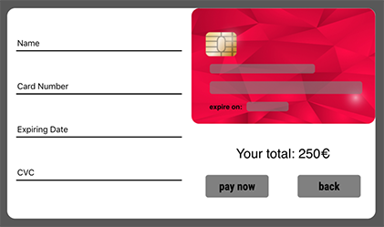

# Card payment with flip animation

A React card payment component with a validation **custom hook** and card flip animation.

[Live link](https://serene-babbage-7068cf.netlify.com/)

## Styling 
I have used the CSS in JS technique with **Styled Components**.

## Custom hook
`useForm.js` is the custom hook, it takes as arguments a callback function (submit function) to execute if the second parameter, the function exported from `Validate.js` returns an empty object. The hook exports errors (if any), the values and some useful functions to format them.

## To do
- [ ] Check type of card and show logo on card (ex. visa, mastercard...)
- [ ] Check card number against card type format(now works just on 16   digits) 

Thanks for your time!

